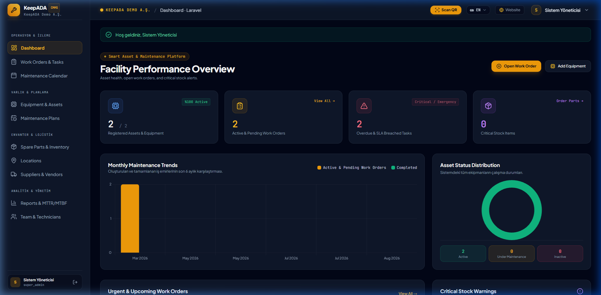
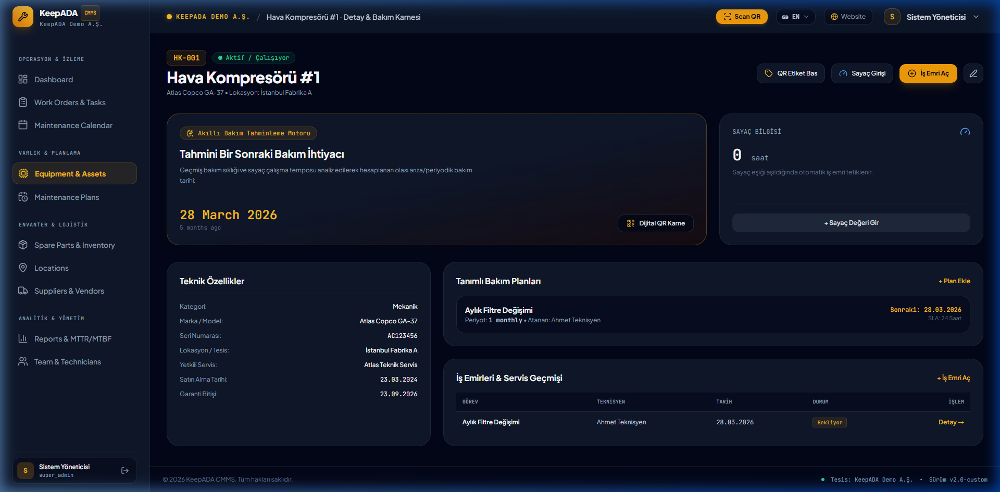
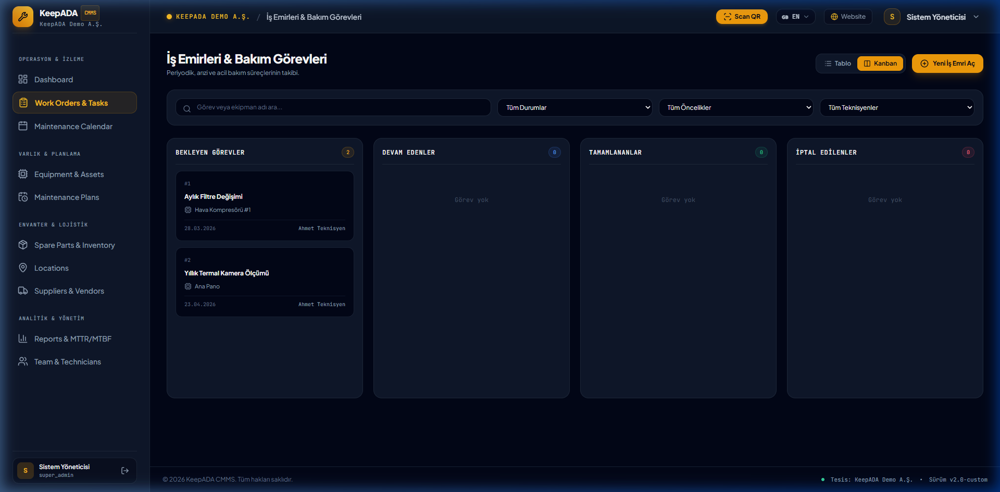
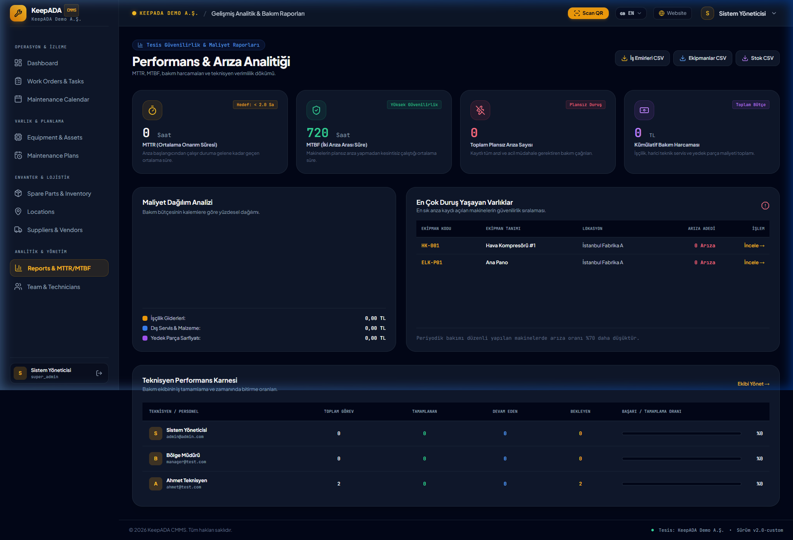
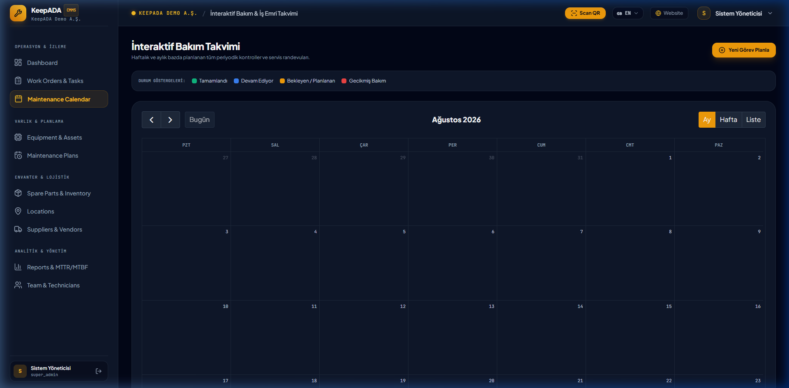
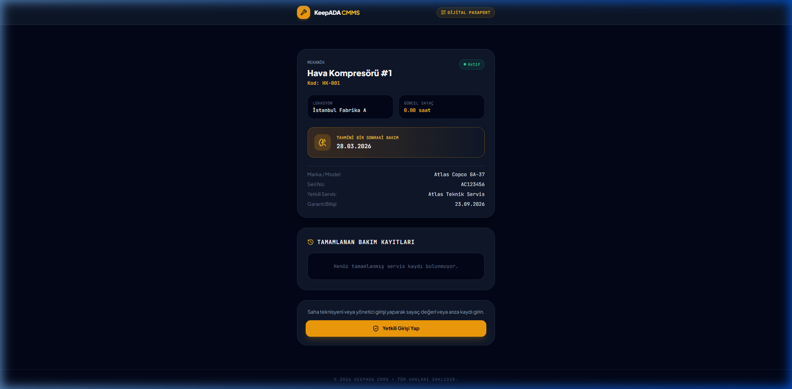
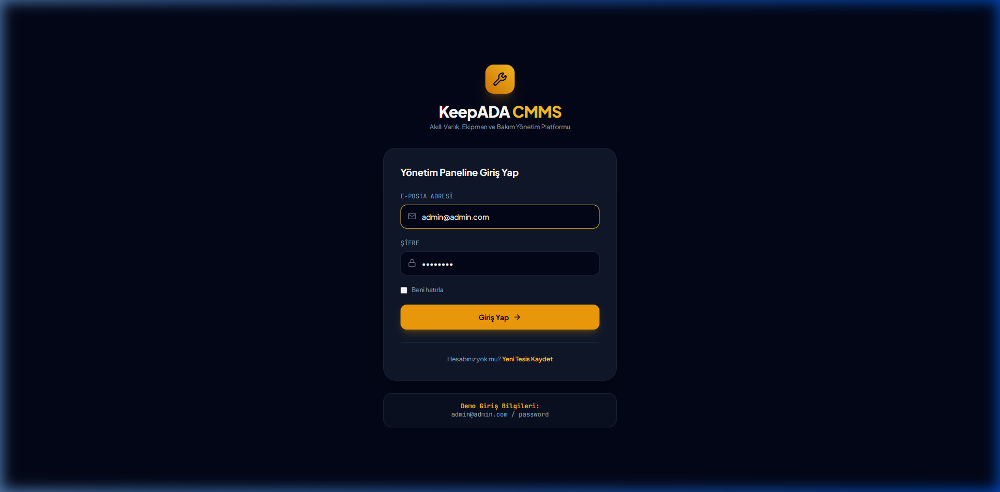

# KeepADA CMMS 🛠️⚡

<div align="center">

**Smart Asset Management, Work Order Scheduling & Predictive Maintenance Platform**

[](README.md)
[](README.tr.md)
[](README.de.md)

[](https://laravel.com)
[](https://php.net)
[](https://tailwindcss.com)
[](LICENSE)

[ 🇬🇧 English ](README.md) • [ 🇹🇷 Türkçe ](README.tr.md) • [ 🇩🇪 Deutsch ](README.de.md)

</div>

---



## 📌 Overview

**KeepADA CMMS** is a modern, high-performance, multi-tenant Computerized Maintenance Management System (CMMS) designed for manufacturing plants, industrial facilities, and technical field operations. Built from the ground up on **Laravel 12**, KeepADA delivers lightning-fast response times, bespoke dark industrial aesthetics, and zero bloat.

---

## ✨ Key Features

### 1. ⚙️ Asset & Equipment Management
- **Digital Equipment Registry:** Comprehensive lifecycle tracking with brand, model, serial numbers, categories, and warranty dates.
- **🧠 AI Predictive Maintenance:** Real-time failure prediction engine estimating next required maintenance based on historical frequency and runtime meter velocity.
- **⏱️ Meter Reading Logging:** Log operating hours, kilometers, or cycle counts with automatic maintenance threshold alerts.
- **🏷️ Printable Industrial Asset Tags (`print-label`):** High-contrast, industrial-grade adhesive sticker templates with QR codes optimized for thermal label printers.

### 2. 📋 Work Orders & Maintenance Tasks
- **Kanban Board & Table Views:** Drag-and-drop / single-click work order lifecycle management (`Pending` ➔ `In Progress` ➔ `Done` ➔ `Cancelled`).
- **⏱️ SLA Compliance Tracking:** Real-time calculation of response and resolution times against target SLAs.
- **💰 Multi-Tier Cost Breakdown:** Detailed tracking of labor costs, contractor fees, and consumed spare parts.
- **📦 Direct Inventory Deduction:** Link consumed parts directly to work orders with automatic stock reduction.

### 3. 📷 Live Camera QR Scanner & Public Passport
- **In-App Live Camera QR Scanner:** Technicians can scan asset tags directly from any smartphone, tablet, or browser webcam.
- **🌐 Public Digital Asset Passport (`/e/{code}`):** Zero-login public passport allowing instant equipment specs lookup and on-site issue reporting by scanning physical QR stickers.

### 4. 📅 Automated Maintenance Scheduler (Cron Engine)
- **Time & Meter-Based Plans:** Define periodic schedule rules (Daily, Weekly, Monthly, Quarterly, Yearly, or Every X Operating Hours).
- **🤖 Automated Task Generation:** Dedicated background command (`php artisan keepada:generate-maintenance-tasks`) scans schedules and auto-spawns work orders.
- **One-Click Manual Trigger:** Trigger all pending maintenance plans on-demand from the web panel.

### 5. 📊 Advanced Analytics, MTTR / MTBF & CSV Exports
- **MTTR (Mean Time to Repair):** Real-time calculation of average equipment repair duration (hours).
- **MTBF (Mean Time Between Failures):** Asset reliability and uptime scoring.
- **📈 Spend Distribution Charts:** Interactive Chart.js doughnut breakdowns (Labor vs Services vs Spare Parts).
- **🏆 Technician Productivity Scorecard:** Team completion rates and on-time performance metrics.
- **📥 Excel-Compatible CSV Exports:** One-click exports for Equipment lists, Work Orders history, and Stock movement ledgers.

### 6. 🌍 Multi-Language Support (i18n)
- Seamless dynamic switching between **English (EN)**, **Turkish (TR)**, and **German (DE)** across panel views and public pages.

---

## 📸 Screenshots Gallery

| Equipment & AI Predictive Forecast | Work Orders Kanban Board |
|:---:|:---:|
|  |  |

| Advanced Analytics & MTTR/MTBF | Maintenance Calendar |
|:---:|:---:|
|  |  |

| Public Digital QR Passport | Secure Login |
|:---:|:---:|
|  |  |

---

## 🛠️ Tech Stack

- **Backend:** Laravel 12, PHP 8.2+
- **Database:** SQLite / MySQL / PostgreSQL
- **Frontend & Styling:** Blade, Tailwind CSS, Alpine.js, Lucide Icons
- **Visualizations:** Chart.js, FullCalendar v6
- **QR Engine:** HTML5-QRCode, QR Server API
- **Authorization:** Spatie Laravel Permission & Custom Tenant Middleware

---

## 🚀 Quickstart & Installation

### 1. Prerequisites
- PHP `>= 8.2` (with `pdo`, `mbstring`, `openssl`, `tokenizer`, `xml`, `ctype`, `json`, `curl` extensions)
- Composer
- Node.js & NPM (optional for asset compilation)

### 2. Clone & Setup
```bash
# Clone the repository
git clone https://github.com/adacreativeco/KeepADA.git
cd KeepADA

# Install PHP dependencies
composer install

# Environment configuration
cp .env.example .env
php artisan key:generate

# Database migration & seeding
php artisan migrate --seed

# Start development server
php -S 127.0.0.1:8090 -t public
```

### 3. Default Demo Credentials
- **URL:** [http://127.0.0.1:8090/login](http://127.0.0.1:8090/login)
- **Email:** `admin@admin.com`
- **Password:** `password`
- **Demo Tenant:** `/panel/keepada-demo/dashboard`

---

## ⚙️ Background Tasks & Cron Setup

Add the following Cron entry to your server to run automated work order generation and overdue SLA notifications:

```bash
* * * * * cd /path-to-your-project && php artisan schedule:run >> /dev/null 2>&1
```

Available artisan commands:
```bash
# Generate work orders from due maintenance plans
php artisan keepada:generate-maintenance-tasks

# Send notifications for overdue work orders
php artisan app:send-overdue-notifications
```

---

## 📄 License

This project is licensed under the **Apache License 2.0**. See the [LICENSE](LICENSE) file for details.

Copyright © 2026 [ADA Creative Co.](https://adacreative.co)
